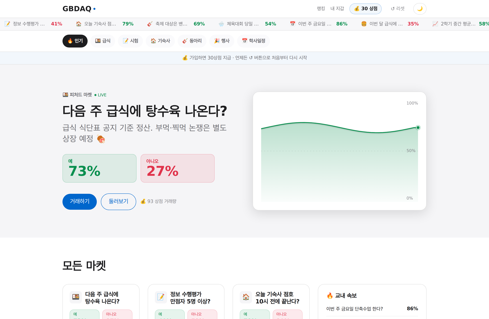
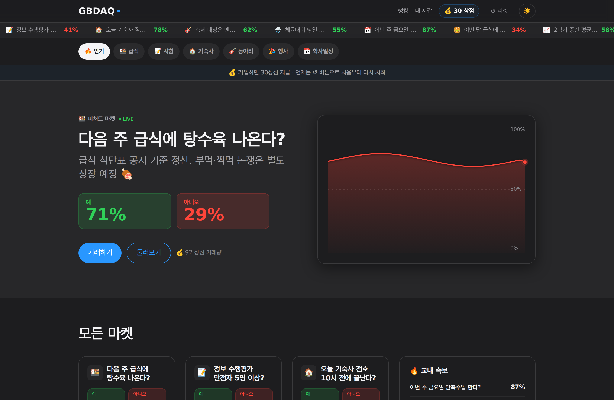
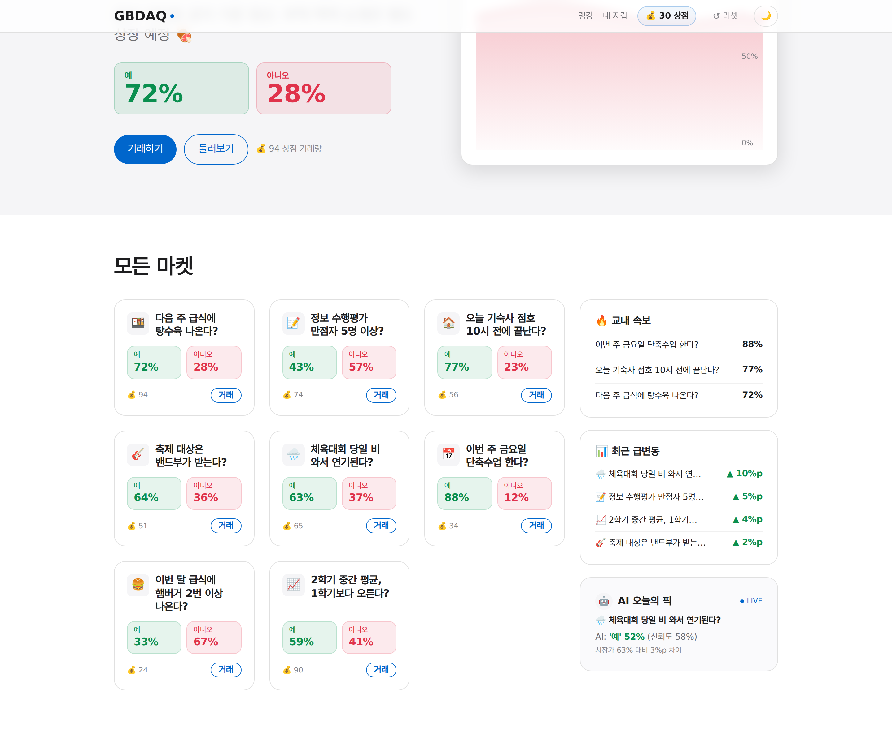
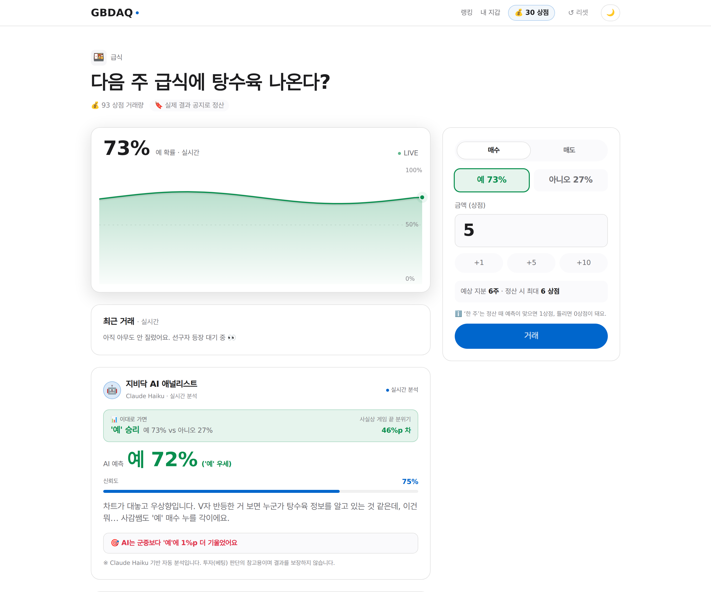

<div align="center">

# 🪙 GBDAQ · 지비닥

### 경북소프트웨어마이스터고 교내 라이브 예측시장

“다음 주 급식에 탕수육 나온다?” 같은 **교내 사건**에 `예 / 아니오`로 베팅하고,<br/>
가격(= 확률)이 **실시간으로 살아 움직이는** 폴리마켓 스타일 예측시장 데모입니다.

<br/>


**[▶ 라이브 데모 — gbdaq.vercel.app](https://gbdaq.vercel.app)**

<br/>



</div>

---

## 💼 사업 모델

이건 교내 베팅 앱이 아니라 **예측시장을 5분 만에 띄우는 *엔진*을 보여주는 라이브 데모**입니다. 파는 것은 ① LMSR 가격 엔진 ② 실제 LLM 애널리스트 파이프라인 ③ 라이브 UX — 셋을 묶은 **화이트라벨**입니다.

- 🏫 **학교·동아리·행사** — 축제·선거 같은 행사에 참여형 소통툴을 빠르게 올린다 (B2B/B2G).
- 🏢 **사내 의사결정 예측시장** — 프로젝트 마감·출시일을 사내 베팅으로 forecasting (실재하는 기업 내부 예측시장 카테고리).
- 💳 **과금** — 주최자 시트 구독 · 이벤트 건당 · SDK 연 라이선스. 참여자는 돈을 내지 않고, 매출은 주최측에서 나온다.
- 🛡️ **규제 비해당** — 전 구간 플레이머니(상점)이며 현금 미환전 → 사행성 규제 비해당, 미성년 안전.

자세한 계획 → [docs/PITCH.md](docs/PITCH.md)

## ✨ 주요 기능

- 🎯 **실시간 예측시장** — 8개 교내 마켓, 4초마다 시세가 움직이는 라이브 가격 + 차트 + 티커
- 📈 **LMSR 가격 책정** — 로그 시장 점수 규칙으로 매수·매도 시 확률·비용·수령액을 정확히 계산
- 🤖 **AI 애널리스트** — 실제 **Claude Haiku**가 시세를 읽고 ‘예/아니오’ 전망·신뢰도·능청스러운 근거를 제시 (서버 라우트 경유, 호출 실패 시 휴리스틱 폴백)
- 💰 **희소 정수 경제** — 30 상점으로 시작, 1 상점 단위 거래라 한 푼이 아쉬운 긴장감
- 🏆 **랭킹 · 내 지갑** — 리더보드, 보유 포지션 평가액, 거래 내역
- 🌗 **라이트 / 다크 테마** — 애플풍 디자인 시스템 + 부드러운 framer-motion 모션
- 🔌 **백엔드 0** — 100% 클라이언트, `localStorage`만으로 동작 (오프라인·즉시 실행, 기기별 독립)

## 🖼️ 미리보기

<table>
  <tr>
    <td width="50%">
      <br/>
      <sub><b>🌙 다크 모드</b> — 라이트/다크 토글, 티커의 ▲▼ 실시간 플래시</sub>
    </td>
    <td width="50%">
      <br/>
      <sub><b>📊 모든 마켓</b> — 카드 그리드 + 교내 속보 · 인기 마켓 · AI 오늘의 픽</sub>
    </td>
  </tr>
  <tr>
    <td colspan="2">
      <br/>
      <sub><b>🔍 마켓 상세</b> — 라이브 확률 차트 · LMSR 거래 패널 · 지비닥 AI 애널리스트</sub>
    </td>
  </tr>
</table>

## ⚙️ 작동 방식

### 📈 LMSR — 가격이 곧 확률

각 마켓은 **LMSR**(Logarithmic Market Scoring Rule)로 가격을 매깁니다. `예` 가격은 0~1 사이의
값이고, 이는 곧 시장이 매긴 **확률**입니다. 매수하면 그 방향 가격이 오르고 반대쪽은 내려가며,
두 가격의 합은 항상 1입니다. 확률·매수 지분·매도 수령액은 모두 [`lib/lmsr.ts`](lib/lmsr.ts)의
순수 함수로 계산되며 단위 테스트로 검증됩니다.

### ⏱️ 클라이언트 가격 엔진

서버·DB 없이 [`lib/demo/store.tsx`](lib/demo/store.tsx)의 `DemoProvider`가 **4초마다** 각 마켓을
random-walk(0.03~0.97 클램프)시켜 새 가격을 history에 push합니다. 차트·티커·카드는 스토어를
읽기만 하면 자동으로 살아 움직입니다. 모든 상태(잔액·포지션·원장·시세)는 `localStorage`에
영속되고, 내비게이션의 **리셋** 버튼으로 초기 시드 상태로 되돌릴 수 있습니다.

### 🤖 AI 애널리스트 (Claude Haiku)

“지비닥 AI 애널리스트”는 이제 **실제 모델**입니다. **Claude Haiku**(`claude-haiku-4-5`)가 시세를 읽고
전망·신뢰도·능청스러운 한국어 근거를 만들어냅니다. API 키는 서버 전용 라우트
[`app/api/analyze`](app/api/analyze/route.ts)에서만 쓰이므로 **브라우저로 새어 나가지 않습니다**.

페이지 로드마다 호출은 **딱 한 번**입니다 — 홈은 보이는 마켓 전체를 한 번에 묶어 분석해 “AI 오늘의 픽”을
고르고, 상세 페이지는 해당 마켓 하나를 분석합니다. 새로고침하면 다시 호출하며, 캐시는 없습니다.
호출이 실패하면(키 없음·레이트리밋·오프라인) **마켓별로** [`lib/ai/fakeAnalyst.ts`](lib/ai/fakeAnalyst.ts)의
결정적 휴리스틱으로 폴백하므로 데모가 절대 깨지지 않습니다.

## 🛠️ 기술 스택

| 영역 | 사용 기술 |
| --- | --- |
| 프레임워크 | **Next.js 16** (App Router · Turbopack) · **React 19** |
| 언어 | **TypeScript 5** |
| 스타일 | **Tailwind CSS v4** · 애플풍 디자인 토큰 (`app/globals.css`) |
| 애니메이션 | **Framer Motion 12** |
| 테스트 | **Vitest 4** (LMSR · AI 애널리스트) |
| 배포 | **Vercel** (`icn1` · 서울 리전) |

## 🚀 시작하기

```bash
npm install      # 의존성 설치
npm run dev      # 개발 서버 → http://localhost:3000
```

### 🔑 AI 키 셋업 (선택)

실제 **Claude Haiku** 애널리스트를 켜려면 API 키가 필요합니다.

- **로컬** — 프로젝트 루트의 `.env.local`에 키를 넣습니다. 동봉된 `.env.example`을 복사해 쓰면 됩니다.
  ```bash
  cp .env.example .env.local   # 그런 다음 ANTHROPIC_API_KEY=sk-ant-... 채우기
  ```
- **배포** — Vercel 프로젝트의 **환경변수**에 `ANTHROPIC_API_KEY`를 등록합니다.
- 키가 없어도 앱은 **휴리스틱 폴백**으로 정상 동작합니다 — 다만 실제 Claude를 쓰려면 키가 필요합니다.

| 스크립트 | 설명 |
| --- | --- |
| `npm run dev` | 개발 서버 (Turbopack) |
| `npm run build` | 프로덕션 빌드 |
| `npm start` | 빌드 결과 실행 |
| `npm run lint` | ESLint |
| `npm test` | 단위 테스트 (Vitest) |

## 📁 프로젝트 구조

```
app/
  layout.tsx           # 루트 레이아웃 — 테마/스토어/토스트/내비 Provider
  page.tsx             # 홈 — 티커 + 카테고리 탭 + 히어로 + 마켓 그리드
  market/[slug]/       # 마켓 상세 — 차트 · 거래 · AI · 규칙
  leaderboard/         # 랭킹
  portfolio/           # 내 지갑 — 보유 포지션 + 거래 내역
lib/
  demo/store.tsx       # localStorage 스토어 + 클라 가격 엔진 (useDemo 훅)
  demo/seed.ts         # 마켓 8개 · 데모 유저 · 시작 잔액(30 상점)
  lmsr.ts              # LMSR 순수 함수 (+ 단위 테스트)
  ai/fakeAnalyst.ts    # 휴리스틱 AI 애널리스트 (+ 단위 테스트)
  format.ts            # 표시 포맷 (상점 · 퍼센트)
components/
  market/              # 카드 · 히어로 · 라이브 차트 · 거래 패널 · 우측 레일
  ai/                  # AI 분석 패널
  ui/ · theme/         # 토스트 · 애니메이션 퍼센트 · 테마 토글
```

## 📝 참고

- 현재는 정산 없이 상시 시세차익만 다루는 **라이브 데모**입니다. 정산(resolution)·멀티테넌트·주최자 대시보드는 상용 로드맵입니다 ([docs/PITCH.md](docs/PITCH.md)).
- **AI 애널리스트는 실제 Claude Haiku** 를 서버 라우트 경유로 호출하며, 실패 시 시세 기반 휴리스틱으로 폴백합니다.
- 상태는 **기기별 `localStorage`** 에만 저장되어 사용자 간 공유되지 않습니다.

<div align="center"><sub>Made for 경북소프트웨어마이스터고 · GBDAQ</sub></div>
